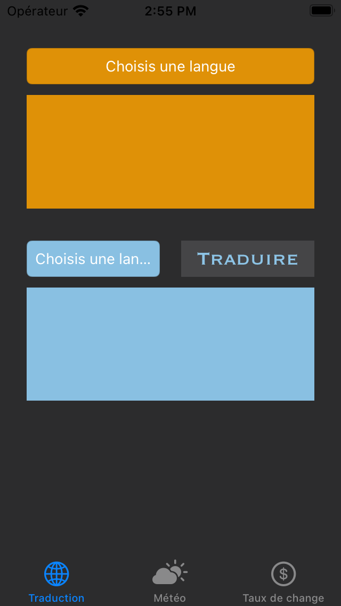
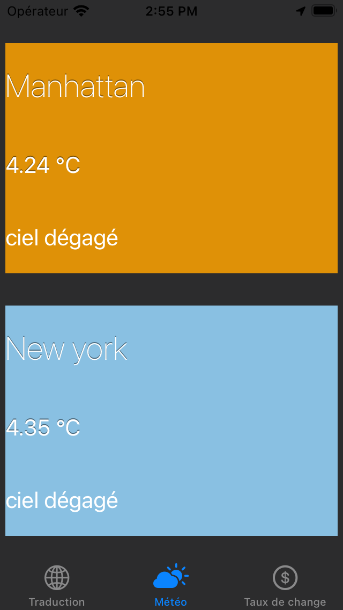
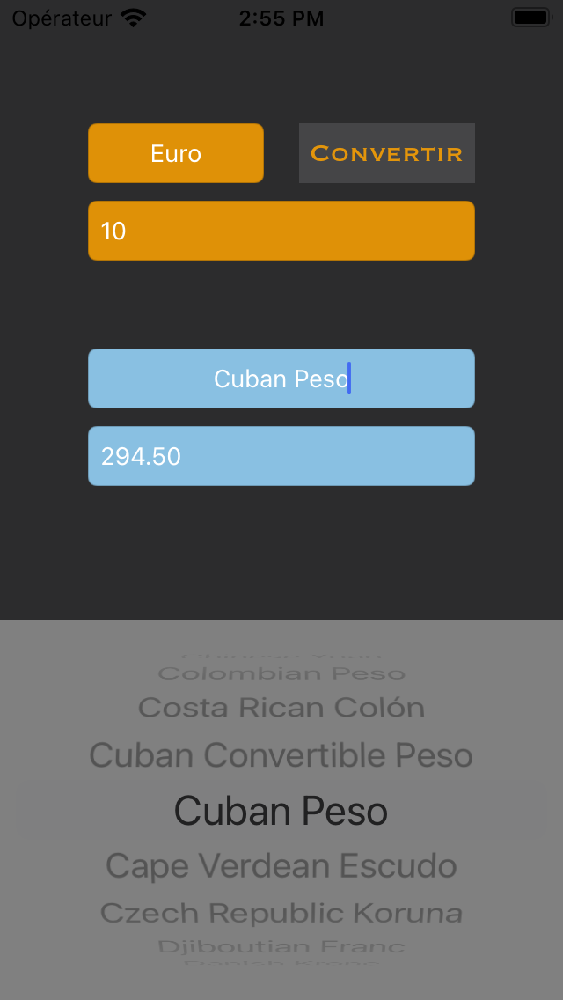

# Projet-9

Réalisez une application de voyage 

Parcours Développeur d'application - iOS 

API keys dans le git ignore -> projet fonctionnel 

# GoodTravel
This project is for my school OpenclassRooms

The application is a exercice for learn API REST and get the user location 

The application is used to :  
- Translate in any languages   
- See the wather on NewYork and user location  
- convert any cuerrencys   

 

